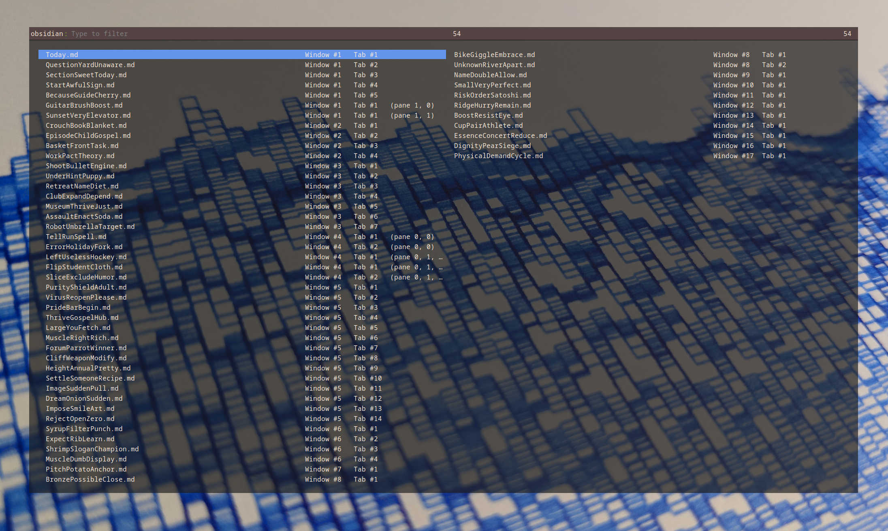

# Rofi Helper

This plugin adds a leaf id parameter to the URI protocol for switching between open obsidian tabs with Rofi. A sample Rofi script is included.

The plugin adds URI params for id, and filename. They can be used like this:

```
obsidian://switch?vault=myvault&id=43ee39f0a20b097a

obsidian://switch?vault=myvault&filename=Today.md
```

A sample script `obsidian-rofi.py` is included. It can be used with [Rofi](https://github.com/davatorium/rofi) like the following examples:

```
# Just switch Obsidian tabs
rofi -modi "obsidian:./obsidian-rofi.py" -show obsidian

# Show all desktop windows as well as Obsidian tabs in the same list of options
rofi -modes combi -show combi -show-icons -combi-modes "window,obsidian:./obsidian-rofi.py"

# Show desktop windows and tabs in different pages (switch with Ctrl+Tab)
rofi -modes "window,obsidian" -show window -show-icons -modi "window,obsidian:./obsidian-rofi.py"
```

This is what switching tabs can look like from a global shortcut in your desktop environment:




This has only been tested on linux.


# How it works

The `workspace.json` file contains the the nested structure of all your open windows, tabs, and panes. Sometimes you may even have the same file open in multiple places. Luckily the "id" associated with each "leaf" is unique. 

Here's a snippet from a workspace.json:

```json
{
  "main": {
    "id": "72987848c4af5ae2",
    "type": "split",
    "children": [
      {
        "id": "58d9b585d8e1dcfc",
        "type": "tabs",
        "children": [
          {
            "id": "43ee39f0a20b097a",
            "type": "leaf",
            "state": {
              "type": "markdown",
              "state": {
                "file": "Today.md",
                "mode": "source",
                "source": false
              }
            }
          },
```

We have "Today.md" in the first window, in the first tab, and it's unique leaf id is "43ee39f0a20b097a".

For a vault name of "myvault", you can switch to this tab with the URI command

```
obsidian://switch?vault=myvault&id=43ee39f0a20b097a
```

The `obsidian-rofi.py` python script will generate options for Rofi to use, including ROFI_INFO data like `\0info\x1f43ee39f0a20b097a`.

Example data fed to Rofi:

```
Today.md                          Window #1   Tab #1 \0info\x1f43ee39f0a20b097a
BalanceQuoteStumble.md            Window #1   Tab #2 \0info\x1fabc2e775384ee4bd
ServiceDoorShield.md              Window #1   Tab #3 \0info\x1fbbd04ae750429c70
MadFemaleRequire.md               Window #1   Tab #4 \0info\x1f869f278435d06213
NuclearBachelorDolphin.md         Window #1   Tab #5 \0info\x1ff7382c4f782e3a96
PalmInquiryIll.md                 Window #1   Tab #1   (pane 1, 0)\0info\x1f4c5b77a0a0ef503a
SwearPleaseUncle.md               Window #1   Tab #1   (pane 1, 1)\0info\x1f0680d3ef4924151a
ChangeWishSilly.md                Window #2   Tab #1 \0info\x1f3bf95912f8aa5762
SuperVerifyPage.md                Window #2   Tab #2 \0info\x1f40951226d95a2b09
AugustNeckActress.md              Window #2   Tab #3 \0info\x1fa95182e08ffd83c9
ArenaRobustMinute.md              Window #2   Tab #4 \0info\x1ffb29a9612dc4d373
SorryVisaCrazy.md                 Window #3   Tab #1 \0info\x1f138011d0535c2b70
JewelBulkScan.md                  Window #3   Tab #2 \0info\x1fa7785009f7d48a86
DemiseMangoAvocado.md             Window #3   Tab #3 \0info\x1fc530b65373eef3cd
RazorWomanSausage.md              Window #3   Tab #4 \0info\x1f8cdb3423a23a6ab3
CrouchPuppySoap.md                Window #3   Tab #5 \0info\x1f6df01c33637a6fd1
FindMandateBoil.md                Window #3   Tab #6 \0info\x1f3cd8d7818da52072
TeachHeavyGuide.md                Window #3   Tab #7 \0info\x1fa6fbb165051c6499
WidthIndustryPear.md              Window #4   Tab #1   (pane 0, 0)\0info\x1f1cacfcf428d48a55
InnocentRadarSpirit.md            Window #4   Tab #2   (pane 0, 0)\0info\x1f1310c5bbe9bb7fa7
HeightSilverLonely.md             Window #4   Tab #1   (pane 0, 1, 0)\0info\x1fb9d4aae2e3c381be
StoryGrocerySearch.md             Window #4   Tab #1   (pane 0, 1, 1)\0info\x1f509c79695d5f1797
SettleWrestleLesson.md            Window #4   Tab #2   (pane 0, 1, 1)\0info\x1fdf6b7d173f33c121
FreshAlcoholPony.md               Window #5   Tab #1 \0info\x1f8c36518811afd173
FlavorBananaStuff.md              Window #5   Tab #2 \0info\x1feeed956c4a5f91ee
AthleteBenefitLava.md             Window #5   Tab #3 \0info\x1f881afaf6dd5cfb3a
VehicleNaiveBrick.md              Window #5   Tab #4 \0info\x1f4024b398ca65ba6e
CarbonBadgeForum.md               Window #5   Tab #5 \0info\x1f77bc0f588a5bc545
SpawnStrategyUniform.md           Window #5   Tab #6 \0info\x1f184d72c238cb1805
CattleEnactShield.md              Window #5   Tab #7 \0info\x1f1a2393cfed658c99
TunaMaximumTortoise.md            Window #5   Tab #8 \0info\x1f334bbc2477d62b14
ShopHalfLift.md                   Window #5   Tab #9 \0info\x1f39f068daabd2e8a5
GrapeChickenCheap.md              Window #5   Tab #10\0info\x1f0d10e38373707ee8
MenuRunPlastic.md                 Window #5   Tab #11\0info\x1fe1f8500ce1284f0d
WarfareDilemmaPeace.md            Window #5   Tab #12\0info\x1f0566d123dd331424
MerryTossDance.md                 Window #5   Tab #13\0info\x1f93a8b2da92c11ce8
SimpleSymptomFemale.md            Window #5   Tab #14\0info\x1f39b9835ebf05122b
ExplainFosterGain.md              Window #6   Tab #1 \0info\x1fdb67248d18558749
DamageIsolateGuide.md             Window #6   Tab #2 \0info\x1f6783ec422ebe1fb5
AffordRecycleInflict.md           Window #6   Tab #3 \0info\x1f89b4e6c22821b78d
LatinSubjectWhere.md              Window #6   Tab #4 \0info\x1f629da7c82cf14852
DadTimeMonth.md                   Window #7   Tab #1 \0info\x1fc844db65dc30aa0a
SoldierDocumentRaw.md             Window #8   Tab #1 \0info\x1f79df1c897507be49
AddressTrickPriority.md           Window #8   Tab #1 \0info\x1fa2e8678d3caef54e
BrokenGunAlbum.md                 Window #8   Tab #2 \0info\x1f711a19246c26c83a
```

After making your selection, Rofi will exit and the URI command is called with xdg-open.

# Getting the script working with rofi

In the included sample script `obsidian-rofi.py` set these two variables with your personal settings:
```
vault_name = 'my-vault'
vault_path = '/home/my-name/my-files/my-vault'
```

If you run this script locally `python obsidian-rofi.py` it should print a list like shown in the previous section like
```
Today.md                          Window #1   Tab #1 \0info\x1f43ee39f0a20b097a
BalanceQuoteStumble.md            Window #1   Tab #2 \0info\x1fabc2e775384ee4bd
ServiceDoorShield.md              Window #1   Tab #3 \0info\x1fbbd04ae750429c70
MadFemaleRequire.md               Window #1   Tab #4 \0info\x1f869f278435d06213
NuclearBachelorDolphin.md         Window #1   Tab #5 \0info\x1ff7382c4f782e3a96
...
```

Next you should `chmod +x obsidian-rofi.py` since it will be called by rofi like a script.

Confirm you get the same output from the program by running `./obsidian-rofi.py`. You might need to adjust the `#!/bin/python` shebang.

Finally some different examples of rofi commands are provided in the previous sections. Ensure the python script is located in a folder in your path (check `echo $PATH`) for them to work.
